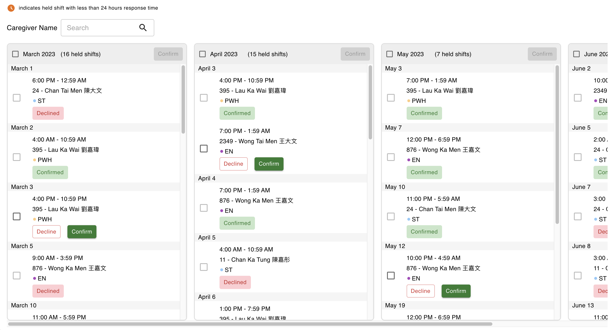

# Responsive Shift Dashboard

Responsive shift dashboard to confirm or decline shift requests from healthcare providers.



## To start

First, start the backend server:

```
cd backend
npm start
```

Second, start the frontend

```
cd frontend
npm run dev
```
